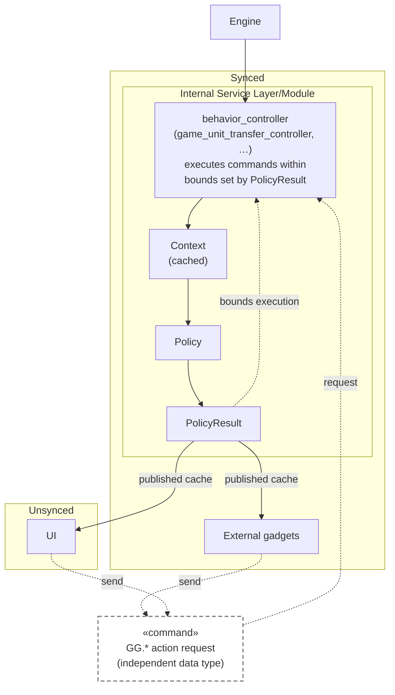

## My [no LLM editor] Description

### Intro

So you find yourself needing to encapsulate state gameside in an expressive way that isn't fighting other hook-based gadget architectures for supremacy. You want to put all of your modifications to game behavior in one place so it's easy to understand and discover. How do you organize this? I had a modular factoring of Sharing that I had originally described then coded for sharing_tab like a year ago, then saw what CampaignAPI was dealing with and did a Leo pointing at the TV when I saw what they were up to.


### Background Recap

This section is basically a quick recap of [Game Controllers & Policies](https://github.com/beyond-all-reason/Beyond-All-Reason/issues/8018), so if you've read that already, skip it.

Capabilities and concepts this branch leverages from upstream branches worth understanding before you dive into this:

* assume type comprehension and intellisense (i.e. EmmyLua) works - because this is also on top of the [fmt-llm](https://github.com/beyond-all-reason/Beyond-All-Reason/pull/8235) branch, we have a working type checker and access to patterns that benefit from intellisense
* policies - strip state out of behavior definition. Turn behavior into data
* inversion of control (IoC) - we are explicitly introducing a service layer in the form of a subset of multiplayer behavior, but this pattern is highly generalizable. This is introducing complexity, but also giving us control we didn't have before.

Going to copy a mermaid diagram I stole from my deeper dive of these topics over in [Transfer Library](https://github.com/beyond-all-reason/Beyond-All-Reason/pull/8125) and change it to include modules:



### Modules


Ok, so let's talk about this.


* leaning heavily on the type system for correctness between files
* has **exactly one way** to do something
* that exactly one way is explicit and typed
  - `module.lua` acts as a manifest, think "package.json" in node apps

    ```lua
    ---@type ModuleManifestFile
    return {
        name = "sharing",
        version = "0.1.0",
        description = "Team resource & unit sharing: transfer runtime, policies, tech blocking, and the sharing tab UI",
        requires = { "economy" },
        provides = {
            shared = "modules/sharing/api.lua",
            unsynced = "modules/sharing/api_unsynced.lua",
        },
    }
    ```

  - `api.lua` makes public an API (bags of methods) to shared (synced and unsynced) contexts, this is equivalent to "index.ts" in node apps:

    ```lua
    return {
        Enums = VFS.Include("modules/sharing/enums.lua"),
        -- unit surface safe in both states: validation, mode unit types, cached pair policy
        Units = VFS.Include("modules/sharing/unit/shared.lua"),
        Take = VFS.Include("modules/sharing/take/comms.lua"),
    }
    ```

  - `api_unsynced.lua` does the same for the unsynced context:

    ```lua
    local Units = VFS.Include("modules/sharing/unit/shared.lua")
    Units.GetCachedPolicyResult = PolicyEvaluation.GetUnitPolicyCached
    -- widget-side verb grafted onto the unit surface (selection -> synced controller)
    Units.ShareUnits = VFS.Include("modules/sharing/unit/unsynced.lua").ShareUnits

    return {
        Resources = Resources,
        Units = Units,
        PolicyViews = {
            Helpers = VFS.Include("modules/sharing/policy_views/helpers.lua"),
            ApiExtensions = VFS.Include("modules/sharing/policy_views/api_extensions.lua"),
        },
    }
    ```

* not **redundant** - namespaces and file names don't repeat themselves. Files are relevant to their directory peers. `modules/sharing/actions/unit_transfer.lua` has 0 ambiguity
* individual files are concise

#### Policies

Policies constrain runtime behavior and drive the UI.

For example, `sharing/policies/unit.lua`
    
```lua
    ---@param ctx PolicyContext
    ---@param modOptions table
    ---@param canShare boolean
    ---@return UnitPolicyResult
    local function buildUnitPolicyResult(ctx, modOptions, canShare)
        local stunSeconds = tonumber(modOptions[ModeEnums.ModOptions.UnitShareStunSeconds]) or 0
        local stunCategory = modOptions[ModeEnums.ModOptions.UnitStunCategory] or ModeEnums.UnitFilterCategory.Resource
        local buildDelaySeconds = tonumber(modOptions[ModeEnums.ModOptions.ConstructorBuildDelay]) or 0
        return {
            canShare = canShare,
            senderTeamId = ctx.senderTeamId,
            receiverTeamId = ctx.receiverTeamId,
            sharingModes = Helpers.ResolveSharingModes(ctx, modOptions),
            stunSeconds = stunSeconds,
            stunCategory = stunCategory,
            buildDelaySeconds = buildDelaySeconds,
            techBlocking = ctx.ext and ctx.ext.techBlocking or nil,
        }
    end

    Policies.Pipeline()
        -- Sender and receiver must be allied, the effective sharing modes must
        -- allow something, and (unless cheating) the receiver must have players.
        :Gate("UnitCanShareGate", function(ctx)
            local modOptions = ctx.springRepo.GetModOptions()
            local modes = Helpers.ResolveSharingModes(ctx, modOptions)
            local canShare = ctx.areAlliedTeams and not (#modes == 1 and modes[1] == ModeEnums.UnitFilterCategory.None)
            if canShare and not ctx.isCheatingEnabled and not Helpers.TeamActive(ctx.springRepo, ctx.receiverTeamId) then
                canShare = false
            end
            if canShare then
                return nil
            end
            return buildUnitPolicyResult(ctx, modOptions, false)
        end)
        -- The gate passed: build the pair's allowed UnitPolicyResult.
        :Compute("ComputeUnitPolicy", function(ctx)
            return buildUnitPolicyResult(ctx, ctx.springRepo.GetModOptions(), true)
        end)
        :Register()

```

Declaration order is evaluation order, first result wins, Compute _always_ answers - the file registers its pipeline and returns nothing, and the filename is the category. A policy can insert its own gate anywhere in the order as long as it conforms.

### Actions

Writing an action file is like writing a widget. You define your functions, you register them, you return nothing. 

- then, `sharing/actions/unit_transfer.lua`. Notice how the ctx is injecting useful data from our pipeline into our function.

```lua
    ---@param ctx UnitTransferContext
    ---@return UnitTransferResult
    Actions.RegisterExecute(function(ctx)
        local policyResult = ctx.policyResult

        if not policyResult.canShare then
            ---@type UnitTransferResult
            return {
                success = false,
                outcome = Enums.UnitValidationOutcome.Failure,
                senderTeamId = ctx.senderTeamId,
                receiverTeamId = ctx.receiverTeamId,
                validationResult = ctx.validationResult,
                policyResult = ctx.policyResult,
            }
        end

        for _, unitId in ipairs(ctx.validationResult.validUnitIds) do
            -- ctx.given should always be false here because we short-circuit inside AllowResourceTransfer
            ctx.springRepo.TransferUnit(unitId, ctx.receiverTeamId, ctx.given)
        end

        ---@type UnitTransferResult
        return {
            success = true,
            outcome = ctx.validationResult.status,
            senderTeamId = ctx.senderTeamId,
            receiverTeamId = ctx.receiverTeamId,
            validationResult = ctx.validationResult,
            policyResult = ctx.policyResult,
        }
    end)
```

`ctx` (short for context, sorry -- I like brevity in lexical scoped variables) provides module-scoped data primitives. But the framework itself provides a baseline primitive to inherrit from. For example `UnitTransferContext inherits from PolicyActionContext`, `ResourcePolicyResult inherits from PolicyResult`, and so on. In this way we can explicitly classify overlap between modules.

#### Domain Namespacing

* **organized by _domain_ category**. This means when you look in the sharing directory/namespace, nothing is talking about anything other than sharing in its file structure. This is in contrast to _technical_ categorization, common in things like Ruby on Rails (e.g. directories named controllers). To me, this just makes sense for a _domain_ layer to be organized by domain categories and it tends to lead to cleaner code because it get people focused on the correct semantic task with their file naming.


#### mod options get broken up

One of the big wins here is modoptions get split up, `modules/sharing/modoptions.lua` is now a thing, root modoptions still returns one flat list - it just assembles it from module fragments. One of @WatchTheFort's biggest fears is mod option bloat, so we move them all to individual modules that need them. This should also benefit the packageability of mods.

#### modes too

Currently, the only `ModeCategory` that exists (i.e. the Sharing Tab's top-of-tab mode dropdown is just `modes where category=Sharing`). So it makes a lot of sense to move those same modes to the module that owns them at `modules/sharing/modes/`.

#### specs

Having the specs live in the module just makes sense. Put them next to the code they're working.

#### modules can be back-ported

Once you have this thing self-contained like this, it's easy to rip these things back out to the engine as exemplars.

### Campaign API

Campaign API is currently an eventing system plus a behavioral override sidecar. The events and scheduler could live as a module that works the same as every other module then we could flip it on or off. But importantly, instead of a sidecar implementation, I'm arguing that we should _refactor_ those behavioral subsystems and make them expose their own internal state as an easy to configure API, via policies or whatever makes sense for their factoring.

### Conclusion

Whew. Sorry. It's a lot. But I do think THIS PR is not boring. This one has a lot of great ideas in it that kind of become apparent (to me anyway) under this organizational structure. Hopefully with ideas from both CampaignAPI and this branch, we can make expressing game behavior considerably easier over time.
