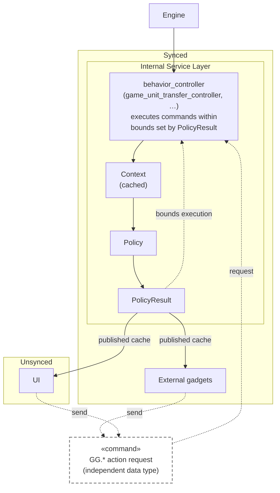

# My [no LLM editor] Description

## Intro

So I'm going to review each line in these PRs, then write in my own words this description/architectural overview. I got help with converting the mermaid diagram from my markdown equivalent pseudo code and had it insert links, but otherwise it's untouched by LLMs -- all me baby.  Hopefully this can explain what is going on and put a more human voice on this design. Going to try to keep these descriptions short and to the point, with the exception of this PR because I need to provide a little context to get people going on this train of thought.

The core conceit here is that for a subset of existing game behavior, we own execution _end to end_. This is me applying my bag of tricks from doing this type of refactor to this type of system countless times. It is largely a UI problem to me, and my usual way to approach that category of problem borrows heavilly from reactive programming. This PR uses the combination of a service layer in the form of the [`unit_transfer_controller`](https://github.com/beyond-all-reason/Beyond-All-Reason/pull/8062/changes#diff-7b689ec0a91aa91bff996e7787265116bbfa5c910a7dd162c2e744e92ab3184bR5) and [`resource_transfer_controller`](https://github.com/beyond-all-reason/Beyond-All-Reason/pull/8062/changes#diff-cad58b69f58e510cea910ed71509772772e590cd04bbad2cfcd7a1cf62d3fae3R3) and then below that a policy pattern or game behavior in order to encapsulate state and categorize commonality between behaviors in our types at various points in our functional execution layer.

## PolicyType

The first real thing to understand is the [`PolicyType`](https://github.com/beyond-all-reason/Beyond-All-Reason/pull/8125/changes#diff-57559e9d13dda6d5f0da09efb5c0106f97f34e26a2626276fdbf27ed6239ef06R5) enum, which represents every type of behavior our modules can express:
* metal_transfer
* energy_transfer
* unit_transfer

Note that this enum could easilly map ALL behavioral categories as part of a more opinionated framework. As we expanded this pattern to other behaviors, this list would grow with the number of behavioral subsystems we refactored into. Therefore, it is important to remember that a lot of the boilerplate orchestrator functions here are truly framework code, even if they're probably not in their final form or directory. They're still a pure function that represents the same exact parameters they will ultimately have under a more opinionated framework. And they are subsequently highly portable.

### How does it fit together?

So we have PolicyType, but what are the other pieces of a unified game side execution in these categories?

Basically, it's:

Let's talk through each piece of that architecture in order.

### PolicyResult

These are the central goal: establish a ["view model"](https://en.wikipedia.org/wiki/View_model) simplifying the game behavior matrix for downstream consumers. This construct is that view model. We're skipping a few steps here but don't worry we'll come back to those other execution steps in a second. 

Let's start with an example, the `UnitPolicyResult`:

See [`UnitPolicyResult`](https://github.com/beyond-all-reason/Beyond-All-Reason/pull/8125/changes#diff-8366865d2a2a90bac6dc2b635e42efc62818ccf543e0cdc86cbe198edf56e6efR29), which extends [`PolicyResult`](https://github.com/beyond-all-reason/Beyond-All-Reason/pull/8125/changes#diff-8366865d2a2a90bac6dc2b635e42efc62818ccf543e0cdc86cbe198edf56e6efR24).

This is our authoritative matrix of game behaviors as it pertains to the `PolicyType`=`unit_transfer` and the type itself existing is inherently simplifying. It is portable across layers in a way that unifies code that deals with that behavior category. Every downstream system just has to consume this type in order to understand every permutation of behavior possible. Each key is orthogonal behavior by design.

Seeing PolicyType and a functional file scoped to a particular one is self-descriptive. We get a way to speak about game behavior at runtime with type enforcement -- in a way that current patterns have major downsides described in the Architecture document [here](https://github.com/beyond-all-reason/RecoilEngine/issues/2781).

### Engine -> Behavior Controller

This part is pretty easy because it's just straight up service layer encapsulating state from an external API. It is the master of its own internal state and all downstream consumers talk to this layer, so it can be confident in its factoring that it is just ensuring its own internal state gets updated correctly and it responds to all engine requests faithful to the wishes expressed by that internal state engine.

### Context (cached inputs)

So `PolicyResult` can only exist with boilerplate that enables them to have their inputs disconnected from the engine. You need a type to express your explicit inputs from the engine to allow hot-swappability and testability for your specific engine API surface. And you also need to build it performantly -- in Lua 5.1. That's where [`ContextFactory`](https://github.com/beyond-all-reason/Beyond-All-Reason/pull/8123/changes#diff-3d3293c660ad4bfacda3b7de017722c3b39fb21f7e5ce05e642803b53ec78abdR13) comes in. It's only job is to build structured, memoized state that can be cached from the engine, that the policies then use to initialize a per-team cache to drive the UI/everything else.

This is some of that "framework" code we talked about earlier. It's common to all types of game behavior and allows us to white list engine state we care about, in the shape we care about it. It is extensible from downstream consumers of a given behavioral service layer (ie game_unit_transfer_controller).

Here is an example from the same beahvioral vertical we have been looking at (unit_transfer) of a `PolicyContext`:

See [`PolicyContext`](https://github.com/beyond-all-reason/Beyond-All-Reason/pull/8125/changes#diff-8366865d2a2a90bac6dc2b635e42efc62818ccf543e0cdc86cbe198edf56e6efR111).

This gives a future developer an explicit understanding of the input data we need and cache for a given behavior expression.

### Policies

Policies produce `PolicyResult` and because we have a clearly input and output type, are extremely unit testable.

Here is the
* [UnitTransferPolicy](https://github.com/beyond-all-reason/Beyond-All-Reason/pull/8123/changes#diff-b048ccd604003f5a2f977cb8f714fef8946a7fd1fe13ee7e6c6eb7a375e65eecR14)
* [ResourceTransferPolicy](https://github.com/beyond-all-reason/Beyond-All-Reason/pull/8123/changes#diff-390bcfbf7ba03de27a9d35497ae5674dddc6c1cffd429b1fb0a5129e41a1c34aR33)

Notice how they are stateless, and do complicated things. But the result is extremely simple for consumers. We do as much work as we can here because it's cached. This reduces complexity for devs that just want to bring their own policy, or make simple modifications to ours. We bound the runtime cost by providing and caching the policies. We can be as expressive as we want on top of that, whether that's this implementation or something that actually builds a clean AST and is more opinionated internally.

### Commands (Actions)

This same pattern is used throughout the service layer. We establish clear inputs and outputs in the form of types for a given behavior, and then ensure our execution code conforms to the boundaries established by the `PolicyResult`.

See [`team_transfer/resource_transfer_synced.lua`](https://github.com/beyond-all-reason/Beyond-All-Reason/pull/8123/changes#diff-390bcfbf7ba03de27a9d35497ae5674dddc6c1cffd429b1fb0a5129e41a1c34aR1)

### UI

It and supporting functions in the widget layer are all simply fluent PolicyResult enjoyers. Very simple, and very easy to rip out functional slices of behavior from things like [`gui_chat`](https://github.com/beyond-all-reason/Beyond-All-Reason/pull/8064/changes#diff-50e9e809ac9691ea91cf6bb0ce6b1cced195ea150a9fdcf978972faaf9970ab0R1) or [`gui_advplayerslist`](https://github.com/beyond-all-reason/Beyond-All-Reason/pull/8064/changes#diff-2036052d0b24abf7a07ed3763cf6b4e2bb6a0d44af63e9971963ccde0ba134a8R1) because you are just coding to the type already, anything that talks about `PolicyResult` is easy to rip out because it's inherently reactive and scoped.

## 1/7 Specific PR Analysis

So that's the meat of it. This PR specifically attempts to lay the ground work by introducing
* all of the types -- including `PolicyType` and the `PolicyResult` types pulled into this system, the various inputs and outputs, internal and external, for the synced-layer team_transfer APIs
* a textbook and generic [`NotifyIfChanged`](https://github.com/beyond-all-reason/Beyond-All-Reason/pull/8125/changes#diff-d1c826b14a7f5db762bd6a0808c2fc7c1be03ddde8532ac00d635750e3e5f790R14) provides change tracking for a given `PolicyResult`
* Comms files provide my take on a classifier using `PolicyResult` to map complicated, fractured requirements into simple functional code that is easy to reason about. 
  - Unit Transfer Comms - team_transfer/unit_transfer_comms.lua
     - [DecideCommunicationCase](https://github.com/beyond-all-reason/Beyond-All-Reason/pull/8125/changes#diff-532460ec0d36855594added46d93334ed11cd80733c9e07623f9713007f4b25cR65)
     - [TooltipText](https://github.com/beyond-all-reason/Beyond-All-Reason/pull/8125/changes#diff-e9ec335d9f7e11b8c525ee9b2c3717ee2d50b9c461e0d5d01265ee1ea5a8d29cR59) - one function that generates every tooltip as it pertains to unit_transfer (e.g. when you hover over the button to do that with a given selection). It provides tooltip information _relevant_ to a given unit selection and `PolicyResult`, which allows it to be VERY specific for players that might be confused about a litany of configurations the game might be in during any given moment, without letting that complexity leak into gui_advplayerlist or gui_chat.

I am SUPER proud of these implementations because they were the most difficult part of this refactor and "doing it right" if you have independently configurable mod options for a given behavior. So they got distilled down to a fine wine reduction of the problem space and I think represent a good demonstration of how much complexity you can disappear with this work.
* things like the [unit_sharing_categories.lua](https://github.com/beyond-all-reason/Beyond-All-Reason/pull/8125/changes#diff-bf00ec6766332f4729b3f0641d039c18445027d75bb9e2e0f0307e22320a7736) is another classifier and used by features like "stun delay category" to target a specific unit "group".
